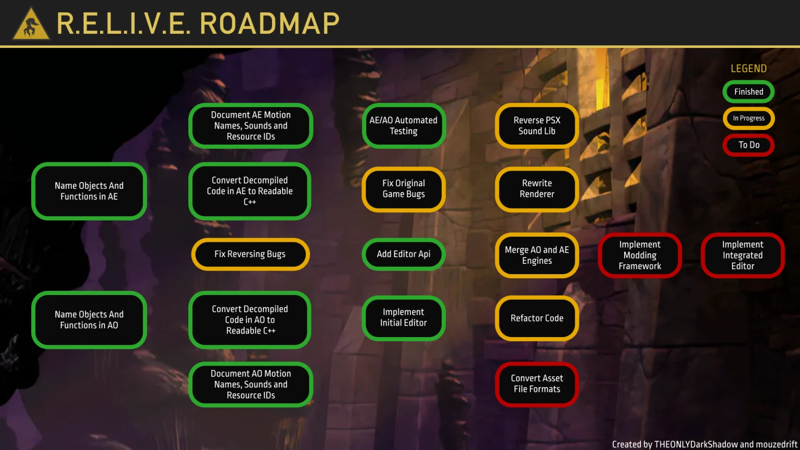

---
---

<main>

<section>

## So what is R.E.L.I.V.E.?

R.E.L.I.V.E. is a drop-in engine reimplementation for Oddworld: Abe's Oddysee and Exoddus.

It is similar to projects like [OpenMW], [OpenRA], [NXEngine], and several other engines, which all intend to fix issues in older games, allow new features to be added to them, and allow curious people to study how exactly these games work under the hood.

In practical terms it is a simple executable you can just drop into the games' respective folder and enjoy the numerous bug-fixes and QoL features it provides. R.E.L.I.V.E. works with the Steam, the GOG, and even the early disk-based version of the game as well. 

[OpenMW]: https://openmw.org/en/
[OpenRA]: https://www.openra.net/
[NXEngine]: https://nxengine.sourceforge.io/

</section>

<section>

## Sounds good, but what exactly can it do?

As of now, R.E.L.I.V.E.:

- fixes over a hundred bugs in the original games, 
- fixes the stuttering cutscenes,
- allows the games to run on Linux and MacOS, 
- allows you to play in windowed mode,
- allows you to play with a controller out of the box,
- lets you run the game in arbitrarily large resolutions,
- and lets you create custom maps with far less limitations than was previously possible.

The engine allows all of this while also remaining faithful to the original games. The intent is that (besides not encountering bugs) there should be no noticeable gameplay difference between playing the retail version and R.E.L.I.V.E.

</section>

<section>

## What further features can I expect from the project?

<figure markdown=0>

<figcaption>
Click on the image to see it in full size.
</figcaption>
</figure>

R.E.L.I.V.E. supports playing through both AO and AE in their entirety and can already be used as a drop-in replacement for the retail executable.

In terms of upcoming features, the following are being worked on:

- ### PSX-quality Music

  Fans who played both on the PlayStation and PC are likely aware that the game's audio sounds far worse on the latter. R.E.L.I.V.E. intends to match the PSX's superior audio.

- ### Modding 
  
  It is a long term goal for the project to eventually completely decouple the games from the engine and allow loading arbitrary assets and logic, letting modders create anything from custom levels to outright derivative games based on the originals' mechanics.

  A notable, already work-in-progress mod is [AbeHD](https://youtu.be/fZSv084R9Vc), which intends to use AI upscaling and fan-contributed assets to create a remastered, HD-version of AO and AE.
  
- ### In-game Level Editor
  
  It is also planned to include an in-game level editor, which would allow mappers to build and test their levels without having to use external tools.

</section>

<section>

## How can I be sure that R.E.L.I.V.E. delivers the same experience as the retail version?

The simplest way is to just [download] the engine and see for yourself. ;)

But for people looking for a more in-depth answer, the project utilizes several methods:

- ### Reverse Engineering

  The most important of these is that R.E.L.I.V.E. is a reverse-engineered project, instead of being built from scratch. In layman's terms this means that instead of writing everything from scratch, the developers working on the game took the already existing executable and through a process called _decompilation_ turned its machine code back into a more readable format.

  This, however, didn't mean that the job was over. The code produced by this process is very convoluted, full of guesswork and other artefacts where the system couldn't guess what the original code could have looked like. So the next few years were spent progressively rewriting this code into something that can be actually understood by people, along with fixing a myriad of bugs in the process and allowing the game to run on Linux and MacOS.

- ### Automated Replays

  It is a reasonable worry that programmers are only people too and just as they can fix bugs, they can introduce new ones and other issues (so called _regressions_) as well. To avoid this, the project employs a technique called automated replays.

  Using a stable version of the engine, a full play-through of the game is captured in a format, that can be replayed using development versions. If anything goes unlike how things should the engine detects the so-called _de-sync_ and records what didn't go as intended.

  This information then allows the developers to catch bugs without having to manually test the game themselves and make sure that the experience doesn't change, even in subtle ways.

- ### Experience

  The development team includes people with long-term R.E. and Oddworld-hacking experience and also members of the speedrunning community. Because of this many errors have been caught simply by the people working on it being aware of the inner workings of the game.

</section>

<section>

## Are you affiliated with Oddworld Inhabitants?

**No.** R.E.L.I.V.E. is a completely volunteer-driven fan project. The team is largely made up of members of the now-defunct Oddworld Forums and the Oddworld Speedrunning community. The list of contributors can be found [here](https://github.com/AliveTeam/alive_reversing/graphs/contributors).

As the project is distributed freely, we rely on donations. You can find the list of donors [here](/index.html#supporters-list) and if you wish to donate yourself, you can do so on [Patreon](https://www.patreon.com/alive) or [PayPal](https://paypal.me/paulsapps).

</section>

<section>

## Wait, aren't you distributing a paid game?

**No.** While R.E.L.I.V.E. is passion project that will always be free to download and tinker with, it requires the original game data to function. The developers of the project do not condone piracy and will not provide these game files to anyone.

If you do not own the games, you can buy them [here](http://www.oddworld.com/buy-games/).

</section>

<section>

## Does R.E.L.I.V.E. require stronger specs?

Despite the code being far more modern, the answer is **no.** 

R.E.L.I.V.E. was made with running on as many platforms as possible in mind and to run on both old and new systems.

Any computer made in the last two decades should easily be able to run it. The engine so far has been tested to run on a Thinkpad T60 and even jury-rigged to launch on Windows XP, using an ancient £10 GPU.

</section>

<section>

## Why "R.E.L.I.V.E."?

The engine's name is a portmanteau of A.L.I.V.E. (the name of the old engine that drives AO and AE) and the abbreviation of Reverse Engineering. It is also a pun referring to the fact that it breathes new life into these old games and allows them to work as new.

</section>

</main>